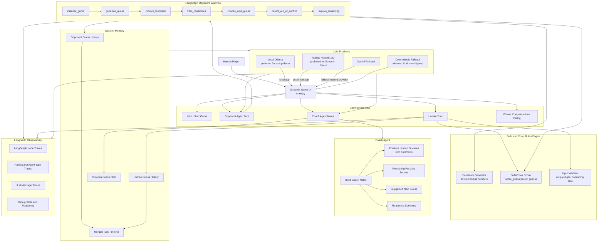
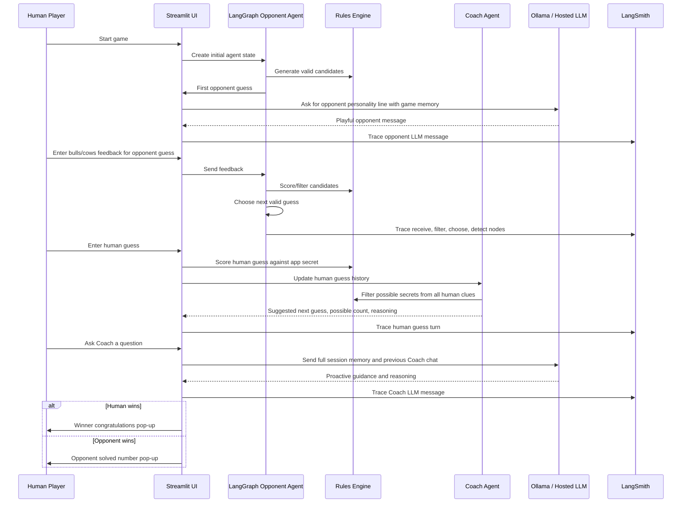

# Bulls and Cows Agent Architecture

This diagram explains how the project works for a presentation or project submission. The core idea is that the game is not a one-shot answer. It is an agent loop: guess, observe feedback, remember history, reduce candidates, choose the next move, and explain what happened.

## Component Architecture

## Turn-by-Turn Flow

## What Each Component Does

| Component | Responsibility | Why it matters |
| --- | --- | --- |
| Streamlit UI | Runs the game screen, inputs, dialogs, Coach panel, and notebook | Makes the agent demo interactive and easy to present |
| Rules Engine | Validates numbers, generates candidates, scores bulls/cows | Keeps game behavior deterministic and testable |
| LangGraph Opponent Agent | Manages the opponent reasoning loop and state transitions | Shows a real agent workflow rather than a single chatbot response |
| Coach Agent | Tracks human guesses, filters possible opponent secrets, suggests next guess, explains why | Helps the human play better using memory and reasoning |
| Session Memory | Stores agent turns, human turns, Coach chat, and a merged timeline | Gives LLM calls the full context without the user repeating history |
| Ollama / Nebius / Gemini | Adds conversational personality and natural-language coaching | Makes the agents feel human while strategy remains explainable |
| LangSmith | Traces LangGraph steps, human turns, and LLM messages | Proves what the agent knew, what it did, and why |

## Five-Minute Presentation Script

1. **Problem**: Bulls and Cows is not a one-answer task. It needs repeated reasoning: guess, feedback, memory, elimination, and next move.
2. **UI**: Streamlit gives the game surface where the human plays against the agent.
3. **LangGraph**: The opponent agent is controlled by a LangGraph workflow. It keeps candidate state, receives feedback, filters impossible numbers, and chooses the next guess.
4. **Coach Agent**: The Coach helps the human by tracking previous guesses, bulls/cows responses, possible remaining secrets, and the suggested next move.
5. **LLM Layer**: Ollama runs locally for the demo. Nebius or Gemini can be used for hosted deployment. The LLM gives the opponent and coach natural language, but it does not replace the deterministic game logic.
6. **Memory**: Every LLM call gets full game context: previous guesses, responses, current phase, candidate count, reasoning, and previous Coach chat.
7. **LangSmith**: LangSmith makes the hidden reasoning visible. It traces the LangGraph nodes, human turns, LLM calls, and state changes.
8. **Closing**: This project demonstrates the full agent pattern: LangGraph for workflow, deterministic tools for logic, LLM for conversation, Streamlit for interaction, and LangSmith for observability.

## Deployment Notes

- Local demo: use `OLLAMA_MODEL` and `OLLAMA_BASE_URL`.
- Published Streamlit app: use `NEBIUS_API_KEY` or Gemini keys because Streamlit Cloud cannot reach your laptop's local Ollama server.
- LangSmith EU endpoint: `https://eu.api.smith.langchain.com`.
